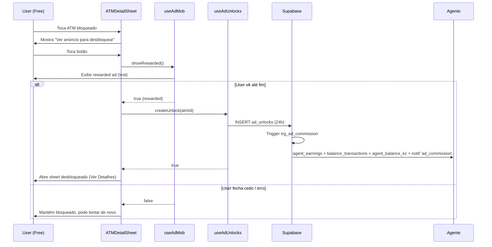

# Design — AdMob Rewarded Ads (Substitui Views Grátis)

**Data:** 2026-08-13
**Estado:** Aprovado para implementação
**Stack:** Expo SDK 54 / RN 0.81.5 / Expo Router / NativeWind / Supabase Staging (`ndvjitfovhfngrzwtytd`)
**Branch base:** `main` (commit `0662eaf` — Fase 6 finalizada e publicada no GitHub)

---

## 1. Visão Geral

Substitui o sistema actual de **views grátis (3/dia)** por **anúncios rewarded AdMob**:

| Utilizador | Antes (views) | Depois (ads) |
|---|---|---|
| **Free** | 3 views/dia → consome `daily_view_usage`, cria `atm_views` (24h), paga 0.15 Kz ao agente | **Sem limite diário**. 1 rewarded ad = 1 ATM desbloqueado 24h. Cria `ad_unlocks`. Agente ganha 0.15 Kz por ad view. |
| **Premium** | Ilimitado, sem views | **Igual** — zero ads, acesso total ilimitado (usa `isPremium` do `useAuth`) |

**Decisões-chave já aprovadas:**
- Manter tabelas legadas (`atm_views`, `daily_view_usage`, `consume_atm_view`, `agent_earnings` via view) — só para histórico/analytics
- Nova tabela isolada `ad_unlocks` (evita pagar comissão por views legadas, sem colisão de índice único)
- 1 ad = 1 ATM por 24h (por ATM, não global)
- Sem limite diário de ads, sem cooldown
- Transição: views de hoje expiram à meia-noite; amanhã só ads. Sem migração de dados
- Comissão por ad view = 0.15 Kz (mesmo `app_settings.agent_commission_free_view_kz`)
- Premium mantém-se igual (subscriptions quarterly/monthly/annual)

---

## 2. Base de Dados (Migração SQL Nova)

### 2.1 Nova tabela `ad_unlocks`

```sql
create table if not exists public.ad_unlocks (
  id uuid primary key default gen_random_uuid(),
  user_id uuid not null references public.profiles(user_id) on delete cascade,
  atm_id uuid not null references public.atms(id) on delete cascade,
  expires_at timestamptz not null,
  created_at timestamptz default now(),
  unique (user_id, atm_id)  -- 1 unlock ativo por ATM por user
);

create index if not exists ad_unlocks_user_idx on public.ad_unlocks(user_id);
create index if not exists ad_unlocks_expires_idx on public.ad_unlocks(expires_at);

alter table public.ad_unlocks enable row level security;

-- SELECT own
drop policy if exists "ad_unlocks_select_own" on public.ad_unlocks;
create policy "ad_unlocks_select_own"
  on public.ad_unlocks for select
  using (auth.uid() = user_id);

-- INSERT own
drop policy if exists "ad_unlocks_insert_own" on public.ad_unlocks;
create policy "ad_unlocks_insert_own"
  on public.ad_unlocks for insert
  with check (auth.uid() = user_id);

-- DELETE own (para limpar expirados se quiser)
drop policy if exists "ad_unlocks_delete_own" on public.ad_unlocks;
create policy "ad_unlocks_delete_own"
  on public.ad_unlocks for delete
  using (auth.uid() = user_id);
```

### 2.2 Realtime publication (para badge/sync multi-device)

```sql
do $$
begin
  if not exists (
    select 1 from pg_publication_tables 
    where pubname = 'supabase_realtime' and schemaname = 'public' and tablename = 'ad_unlocks'
  ) then
    alter publication supabase_realtime add table public.ad_unlocks;
  end if;
end $$;
```

### 2.3 Trigger de comissão — `trg_ad_commission`

**Objetivo:** Replica a lógica de pagamento do RPC `consume_atm_view` (que cria `agent_earnings` + `balance_transactions` + incrementa `profiles.agent_balance_kz` + notificação in-app).

> **Decisão (2026-08-13, opção A):** trigger em **`after insert or update`** + guarda anti-duplicação (em UPDATE só paga se `expires_at` foi renovado/estendido). Assim cada ad view de um mesmo user+ATM paga comissão ao agente (o upsert de re-watch é UPDATE).

```sql
create or replace function public.trigger_ad_commission()
returns trigger
language plpgsql
security definer
set search_path = public
as $$
declare
  v_agent_id uuid;
  v_bank_name text;
  v_commission_kz numeric;
begin
  -- Busca agente e nome do ATM
  select at.agent_id, at.bank_name into v_agent_id, v_bank_name
  from public.atms at
  where at.id = new.atm_id;

  if v_agent_id is not null and v_agent_id <> new.user_id then
    -- Guarda anti-duplicação: em UPDATE só paga se expires_at foi renovado
    if TG_OP = 'UPDATE' and new.expires_at <= old.expires_at then
      return new;
    end if;

    -- Comissão por ad view (setting com fallback 0.15)
    select coalesce(value::numeric, 0.15) into v_commission_kz
    from public.app_settings
    where key = 'agent_commission_free_view_kz'  -- reusa o mesmo setting
    limit 1;

    -- 1. agent_earnings
    insert into public.agent_earnings (agent_id, atm_id, user_id, amount_kz, source)
    values (v_agent_id, new.atm_id, new.user_id, v_commission_kz, 'ad_view');

    -- 2. balance_transactions (credit)
    insert into public.balance_transactions (user_id, type, amount_kz, description, metadata)
    values (v_agent_id, 'credit', v_commission_kz, 'Comissão por anúncio no ATM ' || v_bank_name, jsonb_build_object('atm_id', new.atm_id, 'source', 'ad_view'));

    -- 3. Incrementa profiles.agent_balance_kz
    update public.profiles
    set agent_balance_kz = agent_balance_kz + v_commission_kz,
        updated_at = now()
    where user_id = v_agent_id;

    -- 4. Notificação in-app (tipo 'ad_commission')
    perform public.create_notification(
      v_agent_id,
      'Ganhaste 0,15 Kz via anúncio',
      'Alguém viu um anúncio para desbloquear o teu ATM «' || v_bank_name || '».',
      'ad_commission',
      false
    );
  end if;

  return new;
end;
$$;

drop trigger if exists trg_ad_commission on public.ad_unlocks;
create trigger trg_ad_commission
  after insert or update on public.ad_unlocks
  for each row execute function public.trigger_ad_commission();
```

### 2.4 (Opcional) Novo setting dedicado para ads

```sql
-- Se no futuro quiser valor diferente para ads vs views
insert into public.app_settings (key, value, description)
values ('agent_commission_ad_view_kz', '0.15', 'Comissão ao agente por ad view (Kz)')
on conflict (key) do update set value = excluded.value, description = excluded.description;
```

> **Nota:** O trigger acima usa `agent_commission_free_view_kz` (já existe = 0.15). Se criar o setting dedicado, mudar o trigger para ler `agent_commission_ad_view_kz`.

### 2.5 Extensão `src/lib/supabase-types.ts`

Adicionar tipos para `ad_unlocks` (Row, Insert, Update + FKs).

---

## 3. Cliente — Novos Hooks

### 3.1 `useAdMob` (`src/hooks/useAdMob.ts`)

```typescript
interface UseAdMobResult {
  loadRewarded: () => Promise<void>;
  showRewarded: () => Promise<boolean>; // true = user viu até fim
  isLoaded: boolean;
  loading: boolean;
}

export function useAdMob(): UseAdMobResult
```

**Comportamento:**
- Usa test IDs do `.env` (`EXPO_PUBLIC_ADMOB_REWARDED_ANDROID`, `EXPO_PUBLIC_ADMOB_REWARDED_IOS`)
- `loadRewarded()` carrega o ad em background (chamar no mount do `ATMDetailSheet` ou `map.tsx`)
- `showRewarded()` mostra o ad; resolve `true` se `onAdDismissed` com `rewarded=true`, `false` se fechou sem ver
- **Degrada silencioso** se não instalado / Expo Go / web (retorna `false` sem crash)
- Haptics no reward

### 3.2 `useAdUnlocks` (`src/hooks/useAdUnlocks.ts`)

```typescript
interface AdUnlock {
  atmId: string;
  expiresAt: string; // ISO
}

interface UseAdUnlocksResult {
  unlocks: Map<string, string>; // atmId -> expiresAt (ISO)
  hasValidUnlock: (atmId: string) => boolean;
  createUnlock: (atmId: string) => Promise<boolean>; // insert 24h, retorna true se ok
  loading: boolean;
  refetch: () => Promise<void>;
}

export function useAdUnlocks(): UseAdUnlocksResult
```

**Comportamento:**
- No mount: `fetchUnlocks()` → `select * from ad_unlocks where user_id = $1 and expires_at > now()` → popula `Map`
- Realtime `postgres_changes` (INSERT/DELETE em `ad_unlocks` filtrado por `user_id`) → atualiza `Map` em tempo real
- `hasValidUnlock(atmId)` → verifica `Map` + `expiresAt > now()`
- `createUnlock(atmId)` → `insert into ad_unlocks (user_id, atm_id, expires_at) values ($1, $2, now() + interval '24 hours') on conflict (user_id, atm_id) do update set expires_at = excluded.expires_at` → refresh local + retorna `true`

---

## 4. UI — Alterações por Ecrã

### 4.1 `ATMDetailSheet.tsx` (estado bloqueado) — **Mudança Principal**

**Lógica actual (linhas 246-302):**
```tsx
!isLoggedIn          → "Entrar para ver detalhes"
isPremium            → "Ver Detalhes" (grátis)
remainingViews > 0   → "Ver disponibilidade" + "X desbloqueios restantes hoje"
default              → "Acabaste os desbloqueios de hoje" + "Volta amanhã" + "Upgrade Premium"
```

**Nova lógica:**
```tsx
!isLoggedIn                    → "Entrar para ver detalhes"
isPremium                      → "Ver Detalhes" (grátis, ilimitado)
hasValidUnlock(atm.id)         → "Ver Detalhes" (já desbloqueado via ad)
default (free, sem unlock)     → "Ver anúncio para desbloquear" (rewarded ad)
```

**Fluxo do botão "Ver anúncio para desbloquear":**
1. User toca → `showRewarded()`
2. Se `true` (viu até fim) → `createUnlock(atm.id)` → trigger paga agente → `onUnlock()` abre sheet desbloqueado
3. Se `false` (fechou cedo / erro) → fica no estado bloqueado, pode tentar de novo

**Props novas necessárias:**
- `hasValidUnlock: (atmId: string) => boolean` (vem de `useAdUnlocks`)
- `onWatchAd: () => Promise<void>` (chama `showRewarded` + `createUnlock`)

### 4.2 `map.tsx`

**Remover:**
- `viewsBadge` do header (linhas 151-169) — contador de views restantes
- Import `useViews` (só usava `balance` e `consumeView`)

**Substituir:**
- `unlockedIds` state local (linha 40) → usar `useAdUnlocks.unlocks` (hidratado no mount + realtime)
- `handleUnlock` (linhas 85-99) → novo `handleWatchAd` que chama `useAdMob.showRewarded()` + `useAdUnlocks.createUnlock()`

**Manter:**
- `useAuth.isPremium` para Premium
- `useFavorites` inalterado

### 4.3 `my-views/index.tsx`

**Migrar query de `atm_views` para `ad_unlocks`:**
```typescript
// Antes: .from('atm_views').select(...).eq('user_id', user.id).gt('expires_at', now())
// Depois: .from('ad_unlocks').select(...).eq('user_id', user.id).gt('expires_at', now())
```

**UI:**
- Título: **"Os teus desbloqueios activos"** (era "Os teus desbloqueios de hoje")
- Card superior: mostra **contagem de unlocks activos** (não "restantes hoje")
- Premium: mostra "Ilimitado"

**Remover:** import `useViews` (só usava `balance.isPremium` → usar `useAuth.isPremium`)

### 4.4 `profile.tsx`

**Remover card "Desbloqueios hoje" para free users** (linhas 167-174):
```tsx
// Antes: mostrava balance.remaining para free, "Ilimitado" para premium
// Depois: 
//   - Free: não mostra card (ou mostra contagem de `ad_unlocks` activos se > 0)
//   - Premium: mantém "Ilimitado"
```

**Simplificação:** Usar `useAuth.isPremium` directamente, remover import `useViews`.

### 4.5 `favorites/index.tsx`

**Remover import `useViews`** (só usava `balance.isPremium` → usar `useAuth.isPremium`)

**Opcional:** Passar `lockedIds` de `useAdUnlocks` para `ATMList` mostrar status real (hoje passa `new Set()` = todos bloqueados).

---

## 5. Configuração / Instalação

### 5.1 Dependências (utilizador executa)

```bash
npx expo install react-native-google-mobile-ads
```

### 5.2 `app.json` — Plugin AdMob

```json
{
  "expo": {
    "plugins": [
      [
        "react-native-google-mobile-ads",
        {
          "androidAppId": "ca-app-pub-3940256099942544~3347511713",
          "iosAppId": "ca-app-pub-3940256099942544~1458002511"
        }
      ]
    ]
  }
}
```
> **App IDs acima são OFICIAIS DE TESTE do Google** (funcionam em dev client). Produção depois substitui pelos reais.

### 5.3 `.env` + `.env.example` — Test IDs Oficiais (Rewarded)

```env
# AdMob (test IDs oficiais Google — rewarded)
EXPO_PUBLIC_ADMOB_REWARDED_ANDROID=ca-app-pub-3940256099942544/5224354917
EXPO_PUBLIC_ADMOB_REWARDED_IOS=ca-app-pub-3940256099942544/1712485313
```

> **Não usar os placeholders `ca-app-pub-xxx/xxx` do `.env.example` actual** — não funcionam. Substituir pelos acima.

### 5.4 Dev Client Obrigatório

- **Expo Go NÃO carrega AdMob nativo** (erro de bundling web)
- Testar só com `eas build --profile development` + `npx expo start --dev-client`

---

## 6. Fluxo Completo (User Journey)



---

## 7. Testes e Verificação

### 7.1 Checklist Pré-Implementação
- [ ] Migração SQL aplicada no staging (verificar `ad_unlocks`, trigger, realtime)
- [ ] `npx expo install react-native-google-mobile-ads`
- [ ] `app.json` plugin com App IDs de teste
- [ ] `.env` com rewarded test IDs oficiais
- [ ] `npx tsc --noEmit` OK
- [ ] `npx expo lint` OK

### 7.2 Testes Manuais (Dev Client)
- [ ] Free user: vê ad → desbloqueia ATM 24h → sheet abre → vê detalhes (dinheiro/papel/fila)
- [ ] Free user: fecha ad cedo → continua bloqueado → pode tentar de novo
- [ ] Free user: vê 5 ads seguidos → desbloqueia 5 ATMs diferentes (sem limite diário)
- [ ] Premium user: **não vê botão de ad** → acesso direto "Ver Detalhes"
- [ ] Agente: recebe notificação "Ganhaste 0.15 Kz via anúncio" + saldo incrementa
- [ ] Realtime: unlock num dispositivo → aparece noutro (se logado mesma conta)
- [ ] Cold start: app abre → `useAdUnlocks` hidrata unlocks válidos → UI correcta

### 7.3 Edge Cases
- Ad falha ao carregar (sem internet) → botão continua funcional, `showRewarded` retorna `false`
- User não logado → botão "Entrar para ver detalhes" (inalterado)
- ATM rejeitado/offline → não aparece na lista (já filtrado por `status_approval='approved'`)
- `ad_unlocks` expira → realtime DELETE → `hasValidUnlock` retorna `false` → UI volta a "Ver anúncio"

---

## 8. Fora de Âmbito (Follow-ups)

| Item | Descrição |
|---|---|
| **AdMob Produção** | Substituir test IDs por reais no `.env` + `app.json`; configurar conta AdMob, app-ads.txt, consentimento GDPR/LGPD |
| **eCPM / Revenue Share** | Tracking real de receita AdMob; comissão percentual vs fixa |
| **Limite/Cooldown Ads** | Se abuse detectado: `app_settings.max_daily_ads`, cooldown 30s entre ads |
| **Analytics** | Events: `ad_loaded`, `ad_shown`, `ad_rewarded`, `ad_dismissed`, `ad_error` (enviar para Supabase/PostHog) |
| **Backfill Histórico** | Converter `atm_views` antigas em `ad_unlocks` para analytics unificado |
| **Web Support** | AdMob não funciona no web (Expo) — degradar para "Upgrade Premium" ou banner AdSense (fora de âmbito) |

---

## 9. Ficheiros a Criar / Alterar

### Novos
- `supabase/migrations/20260813000001_ad_unlocks.sql` (migração SQL)
- `src/hooks/useAdMob.ts`
- `src/hooks/useAdUnlocks.ts`
- `src/lib/supabase-types.ts` (extensão: `ad_unlocks`)

### Alterados
- `app.json` (plugin AdMob)
- `.env` + `.env.example` (test IDs oficiais)
- `src/components/map/ATMDetailSheet.tsx` (lógica bloqueado + props novas)
- `app/(tabs)/map.tsx` (remover `useViews`, `viewsBadge`, `unlockedIds` local, novo `handleWatchAd`)
- `app/my-views/index.tsx` (query `ad_unlocks`, título, card superior)
- `app/(tabs)/profile.tsx` (remover card views free, remover `useViews`)
- `app/favorites/index.tsx` (remover `useViews`, usar `useAuth.isPremium`)
- `package.json` + `package-lock.json` (deps AdMob)

---

## 10. Aprovação

**Spec aprovado pelo utilizador em 2026-08-13.** Próximo passo: `writing-plans` para plano de implementação detalhado.